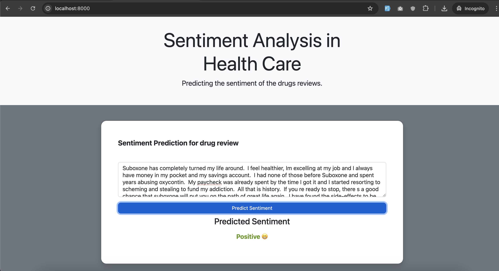
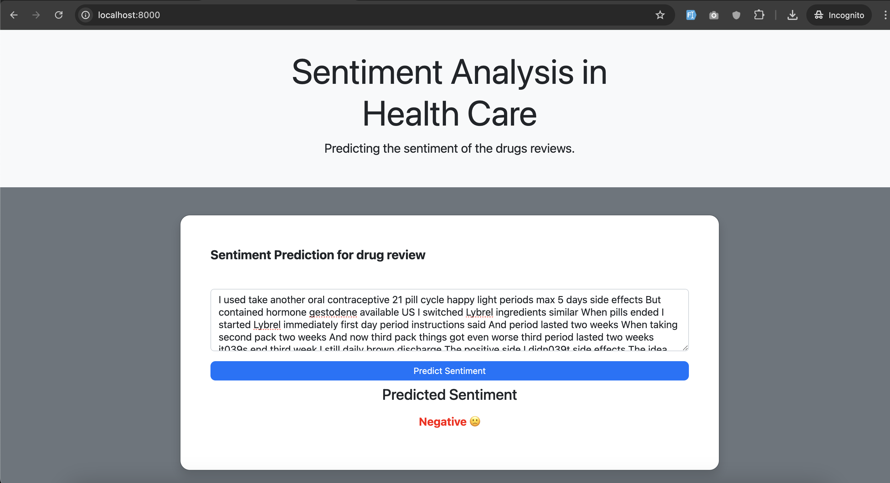
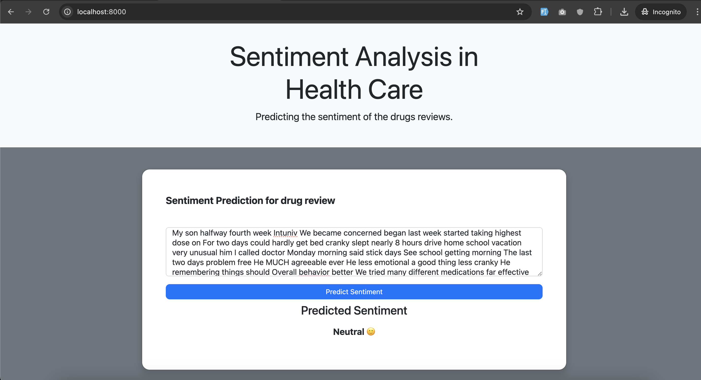

# Sentiment-analysis-drug-reviews
Sentiment analysis of UCI dataset containing drug reviews using fine-tuned BERT model from hugging face.

### Since the fine tuned model is almost 500 MB it is stored in the google drive in the link below.

## Steps to configure: 

### 1. Clone the project
### 2. Download the fine tuned BERT model and paste it in the directory mentioned below:
## Note: Please Download the fine-tuned BERT model from the below google drive link and copy paste it under "/sentimentAnalysis" directory:
https://drive.google.com/file/d/1akxOFgMITCvUMw6Cp-YRpINTQOefyzzP/view?usp=sharing

### 3. Run commands: 

#### python manage.py runserver

# Dataset Used
Dataset can be downloaded through the following link:
https://archive.ics.uci.edu/dataset/462/drug+review+dataset+drugs+com

## Web Application Screenshots

### Positive

### Negative

### Neutral

